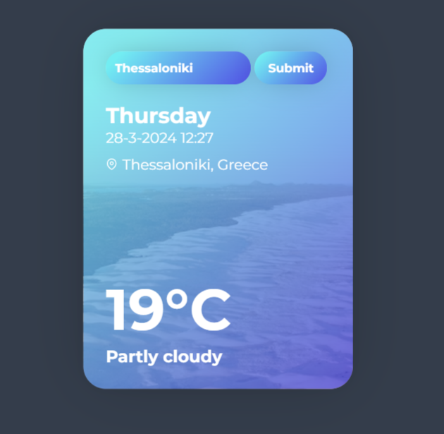

# Weather-Api

# Overview

The Weather API provides access to weather data for various locations around the world. It offers real-time weather information and forecasts.

 Υou can run the weather API widget at the address  <b> [htttps://weather-api.e-quality.site](htttps://weather-api.e-quality.site) </b>

